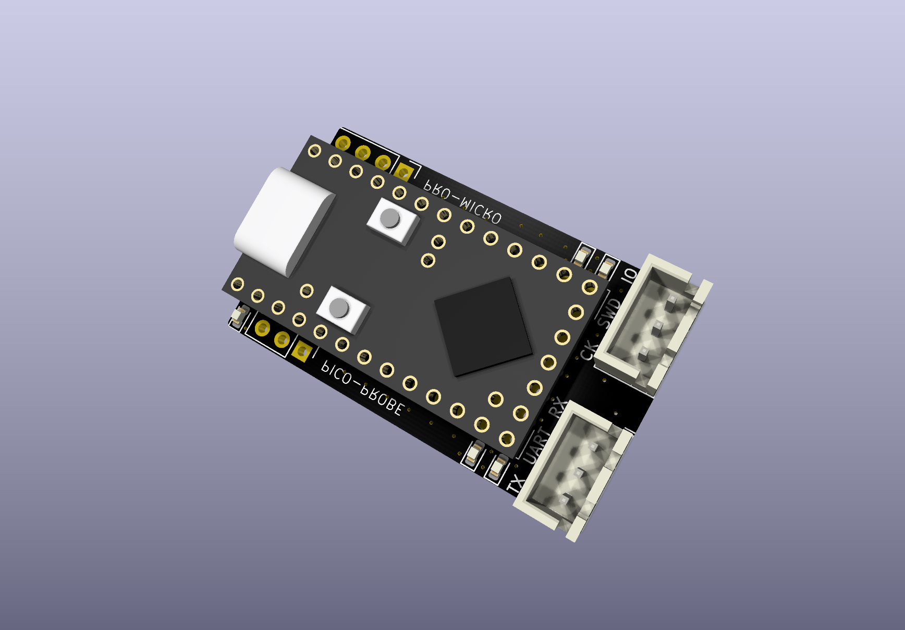
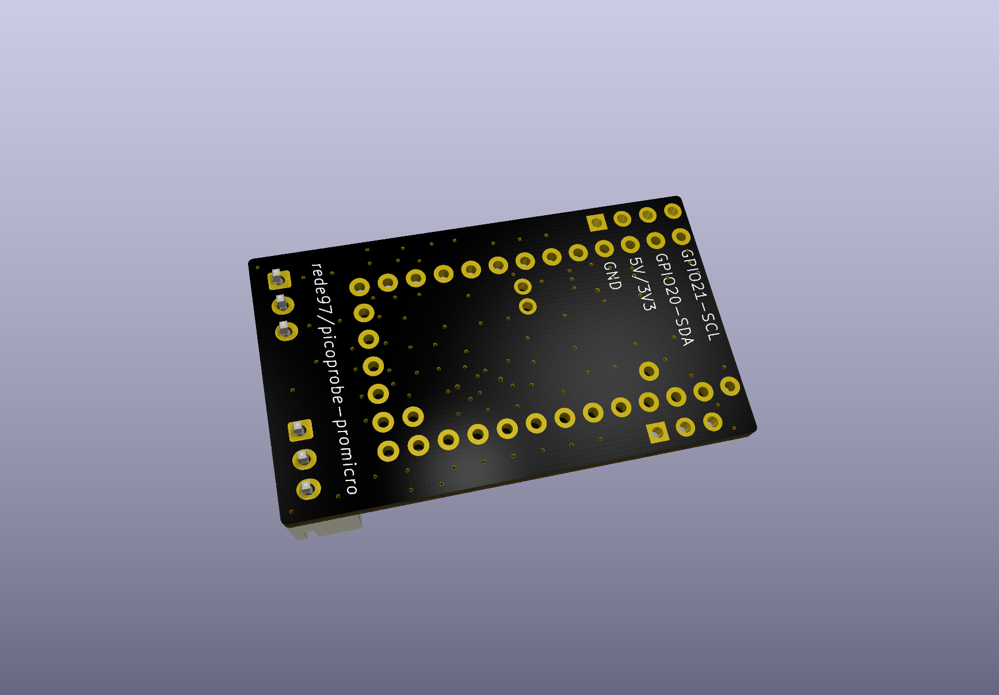

# picoprobe-promicro

[中文版本](README_CN.md)

---

A Raspberry Pi Debug Probe expansion board based on the **RP2040 Pro Micro** core module. The circuit is fully compatible with the [official Raspberry Pi Debug Probe](https://www.raspberrypi.com/products/debug-probe/) — simply plug a RP2040 Pro Micro onto this board, flash the **official Debug Probe firmware from Raspberry Pi**, and you're ready to go. No custom firmware needed.

The RP2040 Pro Micro has onboard **Boot** and **Reset** buttons, making firmware flashing effortless: hold Boot → press Reset → release Boot, and a USB mass storage drive appears — just drag and drop the `.uf2` firmware file. No jumper wires or complicated steps required.

## Compatibility & Reliability

What's truly surprising is how well the Raspberry Pi Debug Probe works beyond its intended target. Its compatibility and reliability are **far beyond expectations**. It not only handles RP2040 chips perfectly, but also delivers rock-solid debugging and flashing for a wide range of **ARM microcontrollers and SoCs** — the full STM32 lineup, Nordic chips like the nRF52840, and virtually any Cortex-M core MCU.

Thanks to the RP2040's **PIO hardware**, the Debug Probe achieves exceptionally fast SWD transfer speeds, matching or exceeding some USB high-speed debuggers in practice. Over long debugging sessions across various target chips, it shows none of the common issues — no disconnections, no timeouts, no failed device recognition.

## Motivation

The official Raspberry Pi Debug Probe has a few shortcomings:

- It still uses a **Micro USB** connector, while USB-C has become the standard
- Flashing Picoprobe firmware onto a bare Pico often leads to **various stability issues**
- Designing a complete dedicated debugger PCB is overkill for many users
- It's essentially just an RP2040 + level-shifting circuit — the official price is steep for a fixed-function debug board

Meanwhile, open-source DAPLink solutions generally have **worse compatibility and stability** across ARM chips compared to the Raspberry Pi Debug Probe.

## Fully Open Source

This is one of the project's biggest strengths:

- **Fully open hardware**: All PCB design files (schematic, layout) are open source in KiCad format. Anyone can inspect, modify, or order their own boards
- **Firmware is fully open source**: Uses the official Raspberry Pi [debugprobe firmware](https://github.com/raspberrypi/debugprobe) directly — no proprietary or custom code. Maintained by Raspberry Pi, continuously updated, with guaranteed quality
- **No closed-source burden**: Many DAPLink debuggers on the market ship with proprietary firmware. When bugs appear, there's no one to report to and no way to upgrade or fix yourself. This solution is open source from hardware to firmware — community-driven and never obsolete

## Regarding JTAG

This project currently supports **SWD** only, not JTAG. From a practical standpoint:

- The vast majority of Cortex-M MCU debugging and flashing only requires SWD — JTAG is not necessary
- If you genuinely need JTAG along with Trace, ETM, and other advanced debugging features, a mature **J-Link** is the better choice — at that point you need a complete professional debugging toolchain, not just a protocol interface

Future firmware-level JTAG support is not out of the question (the RP2040's PIO is capable in hardware), but there are no concrete plans at this stage.

## Design Approach

Rather than designing a complete debugger from scratch, this project pairs a widely available **RP2040 Pro Micro** module with a dedicated expansion board:

- **Flexible**: Use pin headers and female header sockets to temporarily mount the Pro Micro on the board for debugging — detach and reuse it anytime
- **Permanent option**: Solder short pin headers to permanently join the Pro Micro and the board together as a dedicated, long-term debug probe
- **Ultra-low BOM cost**: Significantly cheaper than the official Debug Probe
- **Zero pressure**: No worries about damaging an expensive debugger — hack, modify, or build your own features on top

## PCB Renders

| Front | Back |
|:---:|:---:|
|  |  |

[Download schematic PDF](hardware/picoprobe_sch.pdf)

## Project Structure

```
├── hardware/
│   ├── picoprobe.kicad_sch      # Schematic
│   ├── picoprobe.kicad_pcb      # PCB layout
│   ├── picoprobe.kicad_pro      # KiCad project file
│   ├── picoprobe-front.png      # Front render
│   ├── picoprobe-back.png       # Back render
│   ├── picoprobe_sch.pdf        # Schematic PDF
│   └── kicad_pro_micro_rp2040/  # Pro Micro RP2040 footprint library (submodule)
├── README.md
└── README_CN.md
```

## Dependencies

- [kicad_pro_micro_rp2040](https://github.com/rroels/kicad_pro_micro_rp2040) — KiCad symbol and footprint library for the Pro Micro RP2040
